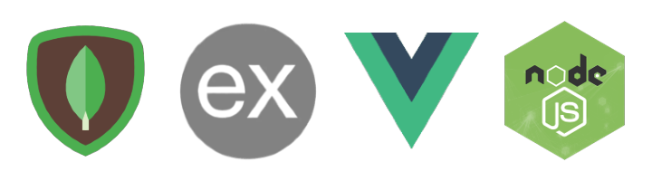

<div align="center">
   
</div>

# Smiler

### [**View Demo →**](https://smiler.darkzarich.com/posts/all)

Smiler is a Reddit-style social platform where users share posts with text, images, and videos, follow creators and topics, and engage through comments and ratings.

## Table of Contents

- [Key Features](#key-features)
  - [Common Features](#common-features)
  - [Backend Key Features](#backend-key-features)
  - [Frontend Key Features](#frontend-key-features)
- [Motivation](#motivation)
- [Project Timeline](#project-timeline)
- [How to Run It](#how-to-run-it)
  - [Prerequisites](#prerequisites)
  - [Option 1: Running Without Docker](#option-1-running-without-docker)
  - [Option 2: Running With Docker](#option-2-running-with-docker)
  - [Option 3: Running With Docker Compose (All-in-One)](#option-3-running-with-docker-compose-all-in-one)
- [Contribution](#contribution)
- [License](#license)

## Key Features

This project is built on the MEVN stack (MongoDB, Express, Vue.js, Node.js), written end-to-end in TypeScript, and is a Single Page Application (SPA) inspired by platforms like Reddit and 9gag. Below are the key features that make this project stand out:

### Common Features

- **Containerized with Docker**: The project is fully containerized using Docker, and the `docker-compose` setup is highly flexible. It can also run without Docker if needed.
- **pnpm Monorepo**: Backend and frontend live in one workspace with shared tooling — ESLint, Prettier, cspell, and type-checking all run from the root.
- **TypeScript End to End**: Both packages are fully typed, including the API client, which shares request and response types with the components that use them.

### Backend Key Features

- **Core Infrastructure**:

  - **Clustering**: If an exception occurs on the server, the app won't crash. Instead, another instance will be spawned to keep the application running.
  - **CORS Protection**: The API restricts access to allowed domains via environment variables.
  - **Rate Limiting**: Read and write endpoints are protected by separate rate limiters.
  - **CSRF Protection**: State-changing requests require a CSRF token, issued and validated per session.
  - **Input Sanitizing and Validation**: Rich text from posts and comments is sanitized server-side, and every endpoint validates its payload before it reaches the database.
  - **Logging**: Every request is logged using [Winston](https://github.com/winstonjs/winston) and [morgan](https://github.com/expressjs/morgan). Logs are also saved to a file for debugging and monitoring.
  - **Integration Testing**: The backend is rigorously tested with **integration tests** to ensure real-world functionality. These tests verify that ORM functions interact correctly with the database, API endpoints return the expected data, a file is actually written to disk or deleted, and dependencies (e.g., ORM, middleware) work as intended, even after updates and so on.

- **Posts**:

  - **Creating Posts**: Users can create posts with a slug generated from the title. Posts are composed of "sections," which can be text, pictures, picture links, or video links. Sections keep their order in the database, and users can add up to 8 sections per post.
  - **Uploading Pictures**: Images can be uploaded directly or via a link. Uploaded images are **resized and optimized** for performance.
  - **Updating and Deleting Posts**: Users can update or delete their posts, but only within 10 minutes of creation.
  - **Feed**: View the latest posts from followed users or tags.
  - **Tags**: Posts can have up to 8 tags, and users can follow or unfollow tags to customize their feed.
  - **Post Retrieval**: Posts can be retrieved with pagination and filtered by author, date, rating, or title regex. The API also shows if the user has already rated a post.
  - **Post Rating**: Posts have a rating system that contributes to the user's overall rating.

- **Users**:

  - **Profile Picture**: Users can set a profile picture using a link.
  - **Following Users**: Users can follow or unfollow other users.
  - **Bio**: Users can add a short description about themselves.
  - **Registration and Authentication**: Standard registration and authentication features are implemented.
  - **Sessions**: The app uses sessions instead of JWT for better security.
  - **Saving Drafts**: Users can save post drafts, including sections, title, and body, without publishing them.
  - **Individual Rating**: Each user has a rating based on the sum of ratings for their posts and comments.

- **Comments**:

  - **Hierarchical Comment Tree**: Comments are displayed in a nested tree structure, with recursive checks to show if the user has already rated a comment.
  - **Creating, Updating, and Deleting Comments**: Users can create, update, or delete comments within a specific time frame, provided no one has replied to them.
  - **Comment Rating**: Comments have a rating system that contributes to the user's overall rating.

- **Swagger Documentation**: Full API documentation is available at `/api-docs/`.

### Frontend Key Features

- **Core Features**:

  - **Auth Guards**: Routes requiring authentication are protected.
  - **Allowed Routes Guard**: Non-existent routes redirect to a 404 page.
  - **Expired Actions Guard**: Prevents access to actions like editing a post after the allowed time has passed.
  - **Global Request Error Notifications**: Errors trigger animated notifications that disappear after a few seconds.
  - **Adaptive Design**: The frontend is fully responsive.
  - **Light and Dark Themes**: A theme toggle backed by CSS custom properties, remembering the user's choice.
  - **Dynamic Document Title**: The page title updates dynamically based on the route.
  - **End-to-End (E2E) Testing**: Most frontend components are covered with **E2E tests** to ensure reliability and a smooth user experience. These tests simulate real user interactions and validate the functionality of the application.
  - **Unit Testing**: Stores and standalone components are additionally covered with **Vitest** unit tests.

- **Posts**:

  - **Multiple Post Pages**: Includes _Today_, _All_, _Blowing_, _Top This Week_, and _New_, each with unique sorting and filtering.
  - **Post Editor**: A [Tiptap](https://tiptap.dev/)-based rich text editor for creating and editing posts, with drag-and-drop reordering of sections.
  - **Preloader**: Smooth loading animations for better UX.
  - **Infinite Scroll**: Loads more posts as you scroll.
  - **Search with Filters**: Search posts with advanced filters.
  - **Following Tags**: Follow or unfollow tags directly from the UI.
  - **Collapsible Content**: Long posts are collapsed in feeds and can be expanded in place.

- **Users**:

  - **Auth State Management**: Handles authentication state, hiding unavailable features for logged-out users.
  - **User Profile Page**: Displays user posts, rating, followers, bio, and avatar.
  - **Follow/Unfollow Users**: Follow or unfollow other users.
  - **Settings**: Manage your profile, including bio, avatar, and followed users/tags.
  - **Registration and Login**: Standard registration and login forms.

- **Comments**:
  - **Tree Comments**: Nested comments with a hierarchical structure.
  - **Rich Text Editor**: For creating and updating comments.
  - **Delete and Update Comments**: Users can delete or update their comments within a specific time frame.

## Motivation

I built Smiler to practice building a full-stack application from scratch, working with the full MEVN stack, experimenting with different architectural patterns and testing strategies along the way. It's a playground for trying out new ideas and seeing what works (and what doesn't) in a real project context — from clustering and file uploads to hierarchical comments and multi-section posts. Starting from February 2026, I also use this project to learn and get comfortable working with agentic coding tools (vibecoding).

## Project Timeline

Smiler has been in development since 2019 and has been through several full-stack rewrites along the way. The collapsed timeline below highlights the milestones — stack migrations, major features, and large refactors.

<details>
<summary><b>Show the project timeline (2019 → today)</b></summary>

### 2019 — The beginning

- **Aug 2019** — Project starts as an [Express](https://github.com/expressjs/express) + MongoDB/[Mongoose](https://github.com/Automattic/mongoose) REST API: posts, users with sessions-based auth, a recursive comment tree, file uploads with image resizing, and Node.js **clustering** so a crashed worker never takes the app down.
- **Sep 2019** — **Swagger** documentation added for the whole API. The **[Vue 2](https://github.com/vuejs/vue) frontend** ([vue-cli](https://github.com/vuejs/vue-cli)) is bootstrapped and the app gets its first deployment to **Heroku**. Auth UI, user profiles, and the post/comment rating system land.
- **Oct 2019** — **Swagger 2.0 → OpenAPI 3.0.0**. Posts are remodeled around **"sections"** (text, picture, picture link, video) instead of a plain body — the single biggest data-model change in the project's history. A custom rich-text **post editor**, tags, following users and tags, the personal feed, search with filters, infinite scroll, and the mobile layout all arrive in the same month.
- **Dec 2019** — Drag-and-drop reordering for post editor sections. Backend gets **[Winston](https://github.com/winstonjs/winston)** request/response logging and global error handling.

### 2020–2022 — Dormant years

- **2020** — Mostly dependency and security bumps. Session cookies reworked for `secure` / `sameSite` so the deployed app works over HTTPS.
- **Apr 2021** — Swagger JSDoc comments rewritten as a standalone JSON spec.
- **2022** — Not a single commit. The project sat untouched for the whole year.

### 2023 — Revival and containerization

- **Feb 2023** — The project comes back to life: **Docker + Docker Compose** for frontend, backend, and MongoDB, a large dependency upgrade across both packages, and flexible layered configs for local vs. published images.
- **Apr 2023** — Frontend build tooling migrates from **vue-cli to [Vite](https://github.com/vitejs/vite)**.
- **Jul 2023** — Deployment moves off Heroku to its own domain.
- **Dec 2023** — First **[Playwright](https://github.com/microsoft/playwright)** E2E setup with mocked API fixtures.

### 2024 — Tests, tooling, and hardening

- **Jan–May 2024** — A full **E2E test suite** is built out: posts, single post, editor, auth, profile, settings, search, tags, comments. Tests are then refactored twice — first onto an **API Page Object**, then onto page objects for every element — and factories move to **[faker.js](https://github.com/faker-js/faker)**.
- **Mar 2024** — Linting infrastructure: **[Stylelint](https://github.com/stylelint/stylelint)** for Vue/PostCSS, **[Prettier](https://github.com/prettier/prettier)**, a reconfigured [ESLint](https://github.com/eslint/eslint), and a custom Stylelint rule enforcing two-dash **BEM** (later published as its own npm package). Backend MongoDB **indexes** are made explicit and optimized.
- **May 2024** — **[cspell](https://github.com/streetsidesoftware/cspell)** spellchecking with a project dictionary. Backend controllers split into per-entity files.
- **Jun 2024** — Frontend design-system pass: SCSS variables → **CSS custom properties**, **[moment.js](https://github.com/moment/moment) → [date-fns](https://github.com/date-fns/date-fns)**, [SVGO](https://github.com/svg/svgo)-optimized icons, Concentric CSS property ordering, and a component-folder restructure with import aliases. [`sanitize-html`](https://github.com/apostrophecms/sanitize-html) added for user content.
- **Jul 2024** — Security and observability: **[helmet.js](https://github.com/helmetjs/helmet)**, timing-attack and unsanitized-regex fixes, JSON-formatted logs with multiple transports, and post categories split from one endpoint into separate ones. **[Jest](https://github.com/jestjs/jest) + [`mongodb-memory-server`](https://github.com/typegoose/mongodb-memory-server)** arrive — the first backend tests.
- **Aug 2024** — Large **error-handling refactor**: typed HTTP error classes, a single global handler, and `async/await` throughout the controllers, replacing ad-hoc `try/catch` and promise chains. All updating endpoints start returning the updated document so the client can sync from responses. A **full UI redesign** ships at the end of the month.
- **Sep 2024** — Pagination reworked with `total` / `hasNextPage`. Backend converts from CommonJS to **ES modules** (`type: module`). Sessions key off `userId` instead of `userLogin`.
- **Nov 2024 – Feb 2025** — A months-long campaign of **backend integration tests** covering nearly every endpoint: posts, comments, auth, users, tags, categories, votes, and uploads.
- **Dec 2024** — Repo moves from **npm to a [pnpm](https://github.com/pnpm/pnpm) monorepo** with a single shared Dockerfile. **[knip](https://github.com/webpro-nl/knip)** added to hunt dead code and unused dependencies.

### 2025 — TypeScript everywhere

- **Mar 2025** — **Backend migrates from JavaScript to [TypeScript](https://github.com/microsoft/TypeScript)**: full `.js → .ts` rename, typed controllers, and Swagger built at runtime. **Mongoose → [Typegoose](https://github.com/typegoose/typegoose)**, with Mongoose itself jumping from v5 to v8.
- **Apr 2025** — **Express 4 → Express 5**. Typed request/response contracts for every controller, remapped TS path aliases across source and tests, and **[swc](https://github.com/swc-project/swc)** for faster compilation.
- **Apr–May 2025** — **Vue 2.7 → [Vue 3.5](https://github.com/vuejs/core)**, the frontend's biggest migration: new global API, updated `v-model`/event syntax, transition classes, and a patched [`vuedraggable`](https://github.com/SortableJS/vue.draggable.next). **[Vuex](https://github.com/vuejs/vuex) 4 → [Pinia](https://github.com/vuejs/pinia)** follows days later.
- **May–Jul 2025** — Every component is rewritten to **Composition API + TypeScript** (`<script setup lang="ts">`), the API client is rebuilt with per-endpoint types, and **[vue-tsc](https://github.com/vuejs/language-tools)** starts type-checking the whole app.
- **Aug 2025** — **Voting system rework**: votes can be flipped to the opposite direction, and deleting a post or comment now correctly rolls back the author's rating and removes the rate documents.
- **Sep 2025** — Playwright tests, factories, page objects, and route objects migrated **from JS to TypeScript** with their own tsconfig.

### 2026 — Security, DX, and agentic coding

- **Feb 2026** — Custom directives replaced with **[VueUse](https://github.com/vueuse/vueuse)**. This is also when the project starts being used to learn agentic coding tools.
- **Mar 2026** — **Light/dark theme system** with a full color-variable refactor, plus **[Vitest](https://github.com/vitest-dev/vitest)** unit tests alongside the E2E suite. ESLint, Prettier, and TypeScript versions aligned across packages.
- **Apr 2026 — security** — The largest **security hardening** push so far: API and write **rate limiting**, a path-traversal fix in upload/delete, **CSRF protection** end to end, hardened sessions, uploads, request logging and request IDs, stricter post/comment/profile validation, unique email and login indexes with normalization, and server-side-only section hashes. User rates move into their own collection with a **MongoDB migration script**.
- **Apr 2026 — editor & DX** — The hand-rolled text editor is replaced with **[Tiptap](https://github.com/ueberdosis/tiptap)**, with rich-text sanitizing on the backend. **[husky](https://github.com/typicode/husky) + [lint-staged](https://github.com/lint-staged/lint-staged)** git hooks added, `AGENTS.md` written, and the backend switches to `lean()` everywhere (`id` → `_id` across both packages).
- **May–Aug 2026** — Collapsible post content in feeds, a reusable **modal/confirm-dialog system** with unit and E2E coverage, and steady dependency upkeep.
- **Aug 2026 — security & performance** — **Stronger password hashing with gradual migration** of existing hashes, case-normalized email/login lookups, faster tag and user filters, **lazy-loaded route components** for a much smaller bundle, and a reworked graceful shutdown. A follow-up **hardening pass** widens the SSRF denylist behind one shared host check, ties uploaded pictures to their own author, forces a hardened `rel` on sanitized links, requires a browser origin for every state-changing request, and adds a **Content Security Policy** and the other security headers to the nginx config. List endpoints drop their per-request `countDocuments` in favour of fetching one document past the page.
- **Aug 2026 — database** — **MongoDB upgraded 5.0 → 8.0** one major at a time, with the test suite switched to clearing collections instead of dropping the database between runs.

</details>

## How to Run It

This project can be run in multiple ways, depending on your preferences and setup. Below are the steps for each scenario:

### Prerequisites

- **Node.js** (>=20.17.0 — see `.nvmrc` for the exact version used in development)
- **[pnpm](https://pnpm.io/)** (>=8.6.0)
- **Docker** and **Docker Compose** (optional, for containerized setups)
- **MongoDB** (can be set up locally, remotely, or via Docker)

---

### Option 1: Running Without Docker

If you prefer not to use Docker, follow these steps:

1. **Set Up MongoDB**:

   - **Option A: Local MongoDB**  
     Install MongoDB locally on your machine and ensure it’s running.
     - [MongoDB Installation Guide](https://www.mongodb.com/docs/manual/installation/)
   - **Option B: Remote MongoDB (e.g., MongoDB Atlas)**  
     Use a remote MongoDB instance like [MongoDB Atlas](https://www.mongodb.com/cloud/atlas). Copy the connection string provided by the service.

2. **Configure Environment Variables**:

   - Rename `.env.example` to `.env` in the root folder.
   - Open the `.env` file and fill in the required values:
     - For **Local MongoDB**: Set `DB_URL` to `mongodb://localhost:27017/smiler`.
     - For **Remote MongoDB**: Set `DB_URL` to the connection string provided by your remote MongoDB service.

3. **Install Dependencies**:

   ```bash
   pnpm install
   ```

4. **Run the Application**:
   ```bash
   pnpm dev
   ```

---

### Option 2: Running With Docker

If you prefer to use Docker, follow these steps:

1. **Set Up MongoDB**:

   - **Option A: Use Docker to Run MongoDB**  
     Run a MongoDB container using Docker:

     ```bash
     docker run -d -v /usr/src/smiler/db:/data/db -p 27017:27017 --name smiler-mongo mongo:8.0.29
     ```

     Update the `DB_URL` in `.env` to `mongodb://smiler-mongo:27017/smiler`.

   - **Option B: Use Remote MongoDB (e.g., MongoDB Atlas)**  
     Use a remote MongoDB instance like [MongoDB Atlas](https://www.mongodb.com/cloud/atlas). Copy the connection string and update the `DB_URL` in `.env`.

2. **Configure Environment Variables**:

   - Rename `.env.example` to `.env` in the root folder.
   - Open the `.env` file and fill in the required values.

3. **Build Images**:
   - Build the images using the following commands:
   ```bash
   docker build --target frontend -t <your_username>/smiler-frontend:latest .
   docker build --target backend -t <your_username>/smiler-backend:latest .
   ```
4. **Run the Application Images with Docker**:
   - Run the images using the following commands:
   ```bash
   docker run -d -p 8080:80 --name smiler-frontend <your_username>/smiler-frontend:latest
   docker run -d -p 3000:3000 --name smiler-backend <your_username>/smiler-backend:latest
   ```

---

### Option 3: Running With Docker Compose (All-in-One)

If you want to run both the application and MongoDB using Docker Compose, follow these steps:

1. **Configure Environment Variables**:

   - Rename `.env.example` to `.env` in the root folder.
   - Open the `.env` file and fill in the required values. For MongoDB, set `DB_URL` to `mongodb://mongo:27017/smiler`.

2. **Run Docker Compose**:
   - Use the provided `docker-compose.yml` and `docker-compose.local.yml` files to start the application and MongoDB together:
     ```bash
     # Optionally add --build to build images instead of pulling them from Docker Hub
     docker compose -f docker-compose.yml -f docker-compose.local.yml up -d
     ```

## Contribution

Feel free to check out the code, open issues if you find bugs, or suggest improvements. Pull requests are welcome too.

## License

This project is licensed under the [MIT License](LICENSE).
